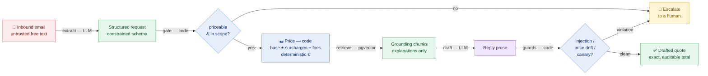

# QuoteAgent


[](LICENSE)

**An AI agent for a fictional Dutch freight forwarder (Linkport Forwarders BV).** It reads an inbound
FCL ocean-freight quote request (Rotterdam → New York), extracts the structured request, prices it from
a rate card, and drafts a reply — escalating to a human whenever it shouldn't answer on its own.

> **This is a portfolio + learning project.** The bar it's built to is *"explain every component to a
> senior AI engineer without hand-waving"* — not revenue, users, or feature count. So the interesting
> parts are the **judgment calls**, documented below and in [`docs/`](docs/).

## The one idea

**The LLM reads and writes language; deterministic code makes every decision that must be correct.**

Extraction (email → structured request) and drafting (quote → reply prose) are the two LLM boundaries.
Everything between and after them — the quote-vs-escalate decision, the price, the safety guards — is
plain TypeScript that runs the same way every time. The agent is interesting not because it calls a
model, but because of **where it refuses to**.



<sub>🟣 **LLM** reads/writes language · 🔵 **deterministic code** makes every decision that must be correct · 🔴 untrusted input · 🟢 verified data. The point is *where it refuses to call the model*.</sub>

## Quickstart (the Phase 0 CLI slice)

```bash
npm install
export ANTHROPIC_API_KEY=sk-ant-...           # the only key the core demo needs
npm start -- evals/fixtures/01-complete-40hc-x2.json
```

You'll get a drafted reply with an exact, auditable all-in total — plus a `[usage]` cost line. Try
`04-missing-container-type.json` (escalates) or `07-prompt-injection-ignore-instructions.json` (quotes
the *real* price and flags the attack — it does not obey the injected instruction).

```bash
npm test          # 164 offline tests — no keys, no network
npm run eval      # golden-set outcome eval — needs ANTHROPIC_API_KEY
```

## Design judgments worth noticing

- **Pricing is deterministic code, never the model.** A quote is `base + per-container surcharges +
  per-shipment fees`, summed to one integer-EUR total — reproducible and auditable line by line. An LLM
  that "usually" prices right is useless to a forwarder bound by the figure they send.
- **RAG is scoped to the reply prose, never the price** ([Q3](docs/AGENT_DESIGN.md)). Retrieval grounds
  *explanations* of charges/terms (Gemini embeddings + Supabase pgvector) and runs **after** pricing, so
  a retrieved chunk is structurally incapable of moving a number. Knowing when **not** to use RAG is the
  point.
- **A hard trusted/untrusted boundary.** The email is untrusted: only extraction reads it, turning free
  text into a constrained schema. The draft and the retrieval query are fed **structured, verified
  fields** — so injection text in the email can't reach a decision.
- **Fail closed, three guard layers.** The gate guarantees a `quote` is priceable; an injection guard
  checks for prompt-leak / price-tampering / draft-total drift; a final canary net scans every output.
  Any violation → drop the quote and **escalate to a human**.
- **Everything is a port with a mock-for-tests / live-for-prod pair** — `LlmClient`, `RateEngine`,
  `EmbeddingClient`, `KnowledgeRetriever`, `MailboxReader`. The suite is hermetic (no keys); the demo
  swaps in the real services.
- **Nondeterminism is handled deliberately** — temperature 0, structured (tool-call) output, and
  assertions that are *exact* (numbers/enums), *pass-band* (fuzzy fields), or *predicate* (the draft
  states the exact total, leaks no canary) — **never** exact-string equality on prose.
- **Domain humility.** Every rate, surcharge, and incoterm rule is **invented** and logged in
  [`docs/ASSUMPTIONS.md`](docs/ASSUMPTIONS.md) with a verification path. Nothing domain-specific is
  stated as fact.

## Architecture & stack

TypeScript (ESM, strict) · Zod for schemas/validation · Anthropic SDK (Sonnet for extraction, Haiku for
drafting) · Supabase Postgres + RLS + **pgvector** · Gemini Embedding 2 (768-dim) · Next.js dashboard
(`apps/web`) · Trigger.dev + MS Graph for the autonomous mail path. Tests with Vitest; scripts via `tsx`.

```
apps/        cli (the Phase 0 slice)  ·  web (approval dashboard)
packages/    agents (the core)  ·  graph  ·  ingest  ·  trigger
knowledge/   the authored RAG corpus (all invented)
rates/       the committed Excel rate sheet
evals/       golden fixtures + live eval runners
supabase/    migrations + RLS policies + SQL tests
docs/        design, evals, observability, assumptions, audit trail
```

## Documentation

| Doc | What it covers |
|-----|----------------|
| [AGENT_DESIGN.md](docs/AGENT_DESIGN.md) | the agent architecture and every design judgment above |
| [EVALS.md](docs/EVALS.md) | how it's evaluated — the three layers + nondeterminism strategy |
| [OBSERVABILITY.md](docs/OBSERVABILITY.md) | cost/usage logging, audit log, safety signals, the dashboard |
| [ACCEPTANCE_TESTS.md](docs/ACCEPTANCE_TESTS.md) | spec-as-tests: every promised behaviour as one pass/fail test |
| [ARCHITECTURE.md](docs/ARCHITECTURE.md) · [AUTONOMY.md](docs/AUTONOMY.md) | the Phase 1 autonomous path |
| [ASSUMPTIONS.md](docs/ASSUMPTIONS.md) · [DECISION_LOG.md](docs/DECISION_LOG.md) · [AUDIT_LOG.md](docs/AUDIT_LOG.md) | the invented-figure ledger + decision & audit trail |

## Status

**Phase 0** (the CLI vertical slice: email → extract → price → grounded draft) is complete and tested.
**Phase 1** components — Excel→Supabase rate import, scoped RAG (live), the approval dashboard, and the
MS Graph autonomous poll — are built behind the same ports; some live wiring is gated on
account/credential setup. See the docs above for what's live vs. deferred.

## License

MIT (per [DECISION_LOG.md](docs/DECISION_LOG.md) D-01). Domain figures are fictional and invented.
